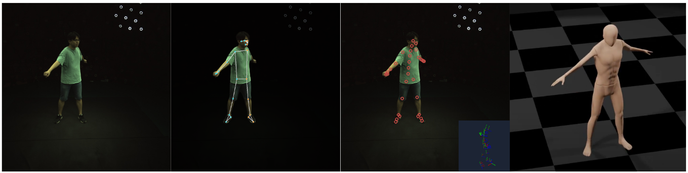

# LISST: Linear Shaped Skeletons for Human Body Modelling




**LISST** is a *light-weight*, *differentiable*, and *parametric* human body model focusing on skeletons. Its down-streaming applications cover **markerless motion capture**, **motion synthesis and control**, **sports**, **game development**, **healthcare**, and beyond.
We further create an extension package [LISST-blender](https://github.com/yz-cnsdqz/LISST-blender) to use our model for character animation and motion re-targeting.


Provided the `body shape`, `body pose`, and `root configurations`, a posed body skeleton is produced via forward kinematics, and is placed in the world space.
We employ the [CMU Mocap](http://mocap.cs.cmu.edu/) dataset to build the body skeleton, learn the shape spaces, pose priors, and others.
Beyond the 31 body joints in CMU Mocap, additional bones are incorporated into the kinematic tree and the shape space, based on human anatomical statistics.


# Notice
- This version is to provide a framework for Assignment 3 of the course [Digital Humans 2023](https://vlg.inf.ethz.ch/teaching/Digital-Humans.html) at ETH Zurich. 
- Code, data, and model will be updated in future versions.
- [The official tutorial slides are here.](https://docs.google.com/presentation/d/1n9_FWMsHK-Iej1kg661XKpPUYipbXGGwX8pEMvK7uZo/edit?usp=sharing)


# Installation

**First**, create a virtual environment by running
```
python3 -m venv {path_to_venv}
source {path_to_venv}/bin/activate
```

**Second**, install all dependencies by running
```
pip install -r requirements.txt
```
Note that other versions might also work but not are not tested. 
In principle, this codebase is not sensitive to the Pytorch version, so please use the version that fits your own CUDA version and the GPU driver.


**Third**, install the `lisst` module into the environmentby running
```
python setup.py install
```


Before running the demos in `demos/*.ipynb`, datasets and checkpoints should be downloaded beforehand.


## For developers
Note that the files in `scripts` are for developers and have special path settings.
To run them properly, the `lisst` module should NOT be installed. Uninstall lisst can be done by
```
pip uninstall lisst
```


# Data and Models

## Data
### Processed CMU Mocap
Our work is developed based on the [CMU Mocap](http://mocap.cs.cmu.edu/) dataset.
We parse the raw `.asf` and `.amc` files, and re-organize them into the **canonicalized** format, which is defined in 
[MOJO](https://yz-cnsdqz.github.io/eigenmotion/MOJO/index.html) and [GAMMA](https://yz-cnsdqz.github.io/eigenmotion/GAMMA/index.html).
One can read `third_party/ACMParser` for detailed implementations. 
Our processed data can be downloaded [here](https://drive.google.com/drive/folders/14I_ufLfGlyldGeC3WrfBEMOiyP40l9wI?usp=sharing), which was used for training and testing our models.
```
CMU-canon-MPx8.pkl # all processed CMU sequences
CMU-canon-MPx8-train.pkl # all processed CMU sequences for training models
CMU-canon-MPx8-test.pkl # all processed CMU sequences for testing models or providing motion seeds
```
***Note that these pre-processed data may change with release versions.***


### ZJUMocap
We use [ZJUMocap-LightStage](https://chingswy.github.io/Dataset-Demo/) for the demo of markerless motion capture. Please download the this dataset first.
We also provide the *Mediapipe Pose* results of the `CoreView_313` sequence [here](https://drive.google.com/drive/folders/1Vfu3vm4_GiZlpGPR2Dwwd56bRxcr1CrD?usp=sharing). 
```
1_mediapipe # this folder contains the rendered results of mediapipe
cam_params.json # the original camera parameters and names
mediapipe_all.pkl # the processed file containing the camera parameters and mediapipe keypoints
```


## Models
Our pre-trained checkpoints can be downloaded [here](https://drive.google.com/drive/folders/1jcMbJgZtZEHqy-R8e1hjiTkR6V41aX08?usp=sharing). These checkpoints correspond to the model config files.
Please put all the downloaded files to the folder `results/lisst/`.

# Tutorials
We provide 2 tutorials in `demos/*.ipynb` to guide users how to use our LISST model. 
Please check these files for details.

# Citations
Please consider to cite the following works
```
@inproceedings{zhang2021we,
  title={We are more than our joints: Predicting how 3d bodies move},
  author={Zhang, Yan and Black, Michael J and Tang, Siyu},
  booktitle={Proceedings of the IEEE/CVF Conference on Computer Vision and Pattern Recognition},
  pages={3372--3382},
  year={2021}
}

@inproceedings{zhang2022wanderings,
  title={The wanderings of odysseus in 3D scenes},
  author={Zhang, Yan and Tang, Siyu},
  booktitle={Proceedings of the IEEE/CVF Conference on Computer Vision and Pattern Recognition},
  pages={20481--20491},
  year={2022}
}
```


